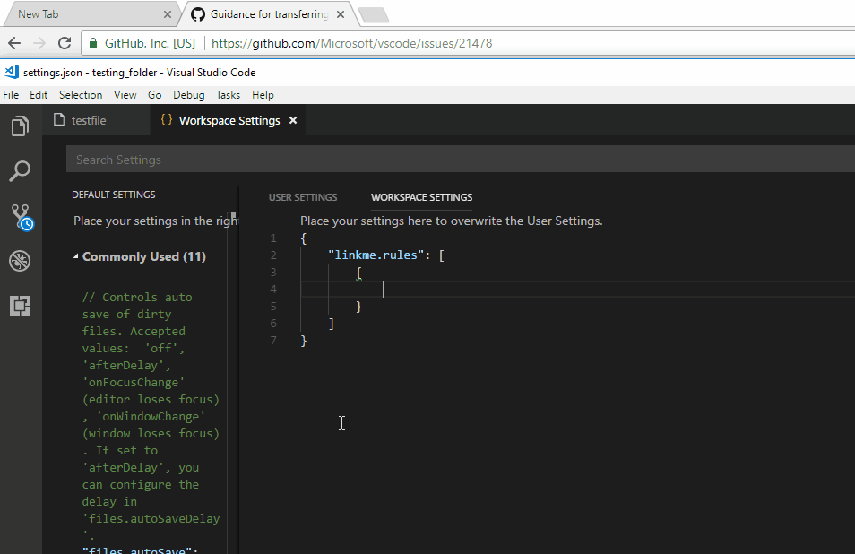

# linkme README

This VS Code extension allows hyperlinking text based on regular expressions.

## Features

## Extension Settings

This extension contributes the following settings:

* `linkme.fieldsOnly`: enable/disable matching words as fields or sections of lines.
* `linkme.rules`: to `[ { "pattern": "", "url": "" } ]` 
    Example: `[ { "pattern": "S:(.*)", "https://google.com/search?q=\\1" }` 
    Result: `"S:never+gonna+give+you+up"` links to [https://google.com/search?q=never+gonna+give+you+up](https://google.com/search?q=never+gonna+give+you+up) 

## Tips
* Test your regular expressions online (google "regex tester" and use the javascript regex engine).
* DON'T set `fieldsOnly` to `false` unless you know what you're doing. Only for users with experience with regular expresssions.
* Make sure to escape special json characters.  
    `/file\.php/` in json is `"file\\.php"`

<!-- ## Release Notes

### 1.0.0

Initial release of linkme -->
